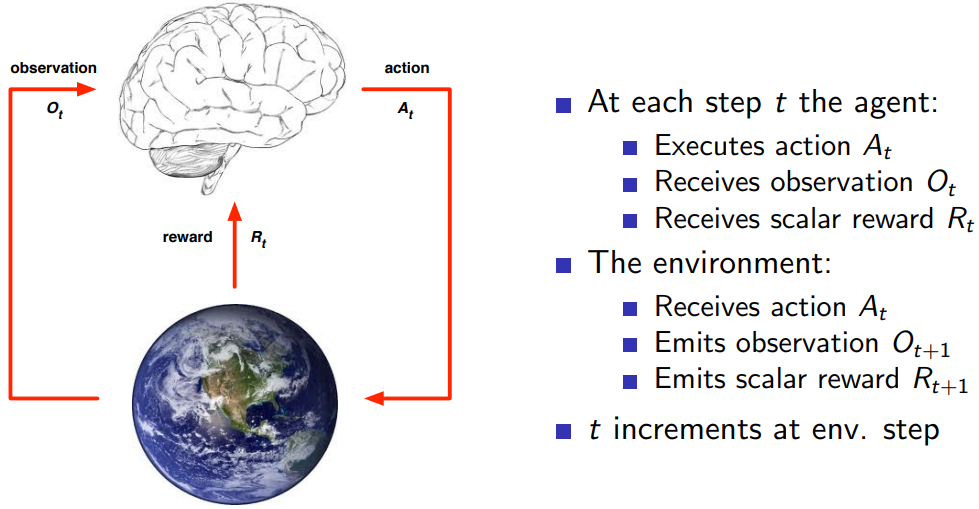
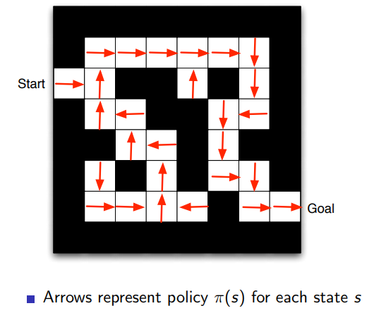
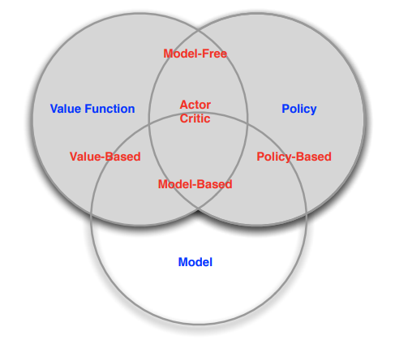
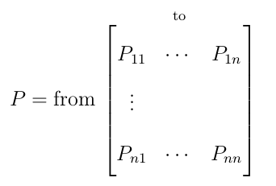
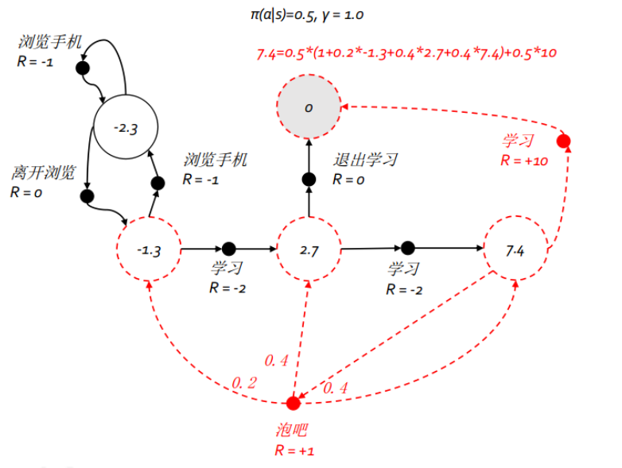
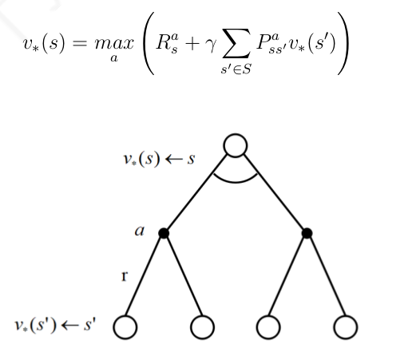
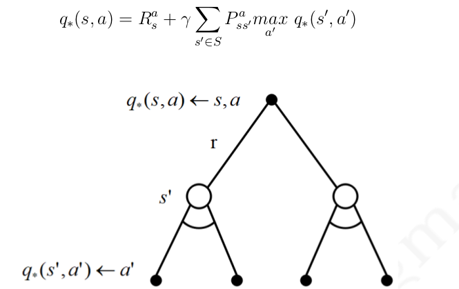

# Reinforment Learning

[TOC]

## 1. Introduction to RL

Machine Learning的三大分支：Supervised Learning, Unsupervised Learning, Reinforcement Learning

RL与其它机器学习算法的不同：

- 没有supervisor，只有reward
- 反馈是延时的，而不是及时的
- 时间非常重要，数据是时序的，而不是独立同分布的数据（在监督学习中所有假设所有数据是独立同分布的）
- Agent的action将影响将来得到的数据

### 1.1 核心概念

- Reward
  
- Reward，Rt 是一个标量反馈信号，就是一个分数，代表在t步时，一个action的效果是好的还是坏的。强化学习是基于Reward Hypothesis的，就是最终的目标是最大化累积奖励（maximisation the cumulative reward）。比如在直升机花式表演的例子中，如果是按照路径走，就会加一个分，如果不是就减个分。
  
- Environments：外界环境，比如风速

- State

  - History and State 状态是Ht的函数，Ht=O1,R1,A1,....Ot,Rt,At，St=f(Ht)。也就说是历史的所有选择造成了现在的状态，就和人生一样，你现在的生活状态就是从出生到现在所有的选择的结果，比如高考选择了哪个学校，大学是否努力，毕业后又选择了哪个公司上班等等。而现在的状态又是下一个选择的信息基础。

  - Environment State

    Ste

  - Agent State

    Sta = f(Ht)

  - Information State

    又叫Markov state，下一个状态St+1只基于当前的一个状态St。隐马尔可夫中的隐状态的转化也是基于这个假设的。
    $$
    P[S_{t+1}|S_t] = P[S_{t+1}|S_1,S_2,...,S_t]
    $$
  
- Fully Observable Environments
  
  Agent可以直接观察到环境的状态：
  
  Ot = Ste  = Sta
  
  这是一个Markov决策过程（Markov Decision Process, MDP）
  
- Partially Observable Environments
  
  Agent不能观察到环境的状态，没有上帝视角了，Agent的状态不等于环境的状态 ，Sta  not = Ste
  
  这是一个 partially observable Markov decision process，POMDP。
  
  这个时候Agent需要构建自己的State，可以从历史中来，也可以用概率的方法从上一个状态进行来，或者用RNN来获取。
  
- Agent

在t步时，Agent获取到观察值Ot，和之前采取action的奖励Rt，从这里可以看出来奖励是有延时性的，然后采取action给环境，环境收到At，并输出Ot+1和标量Rt+1。

### 1.2 Agent的组件

- Policy是Agent的behavior function，是从state到action的映射;

  - Deterministic policy：如果状态是s则采取行动a
    $$
    a = \pi(s)
    $$

  - Stochastic policy：如果状态是s，则采取行动a的概率
    $$
    \pi(a|s) = P(A_t=a|S_t=s)
    $$
    

- Value function：将来reward的一个预测，在当前状态s下，下面所有步的奖励的期望，Value function也是基于action function的，也就是说，action function不同，value function也是不同的。  
  $$
  v_\pi(s)=E_\pi[R_{t+1}+\gamma R_{t+2}+ \gamma^2R_{t+3} + ...|S_t=s]
  $$

- Model： Predict what the environment will do next，比如 ：

  - 基于当前状态s和行动a，预测下一个状态为s'的概率：

  $$
  P_{ss'}^a = P[S_{t+1}= s' | S_t = s,A_t=a]
  $$

  - 基于当前的状态s和行动a，预测一下奖励为Rt+1的期望：即时奖励

  $$
  R_s^a = E[R_{t+1}|S_t=s,A_t=a]
  $$

  环境给出的Reward是通过Model预测出来的。Agent创建一个Model来表示环境如何工作，创建一个自己对于 环境的映射。
  
  -1代表每一步减去一个奖励，这是一个即时奖励。
  
  Maze Example:
  
  

### 1.3 根据组件分类

- 分类1
  - Value Based
    - No policy
    - Value Function
  - Policy Based
    - Policy
    - No value function
  - Actor Critic
    - Policy
    - Value function
- 分类2
  - Model Free
    - Policy and/or Value Function
    - No model
  - Model Based
    - Policy and/or Value Function
    - Model
  
  

### 1.4 Problem of RL

- Learning and Planning

  - Reinforce Learning：环境一开始是未知的，需要与环境进行交互，并提高策略。比如Atari Example：游戏规则是不知道的，只能拨动摇杆并看到图像和分数。
  - Planning：环境是已知的，不用与环境进行额外的交互。比如Atari Example：游戏规则是知道的，在Agent里有一个模拟器，可以知道每动一次摇杆的结果。 

- Exploration and Exploitation

  - Exploration  finds more information about the environment
  - Exploitation exploits known information for maximise reward

  ​	比如：Restaurant Selection

  - Exploration: Try a new restaurant
  - Exploitation : Go to your favourite restaurant

- Predict and Control

  - Predict: 利用已知的policy来预测将来的结果，policy是固定的。Given a policy，evaluate the futrue
  - Control:找到一个最优的policy。 optimise the future, Find a optimise policy

## 2. Markov Decision Process

### 2.1 Markov Process

 在一个时序过程中，如果t+1时刻的状态仅取决于t时刻的状态St，而与t时刻之前的任何状态无关，则认为t时刻的状态St具有马尔可夫性（Markov property）。若过程中的每个状态都具有马尔可夫性，则这个状态具备马尔可夫性。具备了马尔可夫性的随机过程，叫做马尔可夫过程（Markov Process），又叫做马尔可夫链（Markov Chain）。描述一个马尔可夫过程的核心是马尔可夫转移矩阵：
$$
P_{ss'}=P[S_{t+1}=s'|S_t=s]
$$

通常使用二元组<S,P>来表示马尔可夫过程，S是有限数量的状态集，P是状态转移矩阵，每一行的和为1。从一个符合马尔可夫过程的状态转移矩阵中生成一个状态序列的过程叫做采样（sample）。

### 2.2 Markov Reward Process

马尔可夫过程中加入奖励（reward）构成一个四元组<S, P, R, gamma>，叫做马尔可夫奖励过程。

收获（return）：即时奖励与后续所有奖励的衰减的和。
$$
G_t = R_{t+1}+\gamma R_{t+2}+\gamma^2 R_{t+3}... = \sum_{k=0}^\infty \gamma^kR_{t+k+1}
$$
状态价值（value）：一个状态的价值是状态收获的期望。整理成即时奖励与下一个状态的价值乘以衰减系数和的期望。
$$
\begin{align}
v(s)&=E[G_t|S_t=s] \\
&=E[R_{t+1}+\gamma R_{t+2}+\gamma^2 R_{t+3} +...|S_t=s] \\
&=E[R_{t+1}+\gamma (R_{t+2}+\gamma R_{t+3} +...)|S_t=s] \\
&=E[R_{t+1}+\gamma G_{t+1}|S_t=s] \\
&=E[R_{t+1}+\gamma v(S_{t+1})|S_t=s]
\end{align}
$$

Rt+1的期望还是Rt+1，而下一个状态的价值可以由状态转移矩阵求得。从而引出贝尔曼方程（Bellman Equation）。
$$
v(s)=R_s + \gamma\sum_{s'\in S}P_{ss'}v(s')
$$
可以直接求解，但是时间复杂度是n(O3)

### 2.3 Markove Decision Process

马尔可夫奖励过程并不解决强化学习问题，需要加入个体的行为选择，马尔可夫决策过程是由 <S, A, P, R, gamma>五元组成。

- S 有限的state集合

- A 有限的action集合

- P基于行为的状态转移矩阵（与状态转移矩阵不一样），当前状态s和行动a的条件下转化为状态s'的概率：
  $$
  P_{ss'}^a = P[S_{t+1}=s'|S_t=s,A_t=a]
  $$

- R是基于行为的奖励函数，在状态s和行动a条件下，即时奖励的期望：
  $$
  R_s^a = E[R_{t+1}|S_t=s,A_t=a]
  $$

- gamma是discount factor在[0, 1]范围内

马尔可夫决策过程与马尔可夫奖励过程差别还是挺大的。奖励的分是在行为上的，而不是在状态上了，这点要区别。

个体在一个状态下从行为集合中选择一个行为的依据则称为策略（**Policy**），用 $\pi$ 表示在一个状态下，基于行为集合的概率分布。策略是个体行为产生的机制，是不随状态变化而变化的，被认为是静态的。随机策略是一个常用的策略。
$$
\pi(a|s) = P[A_t=a|S_t=s]
$$

在s状态下采取行动的概率分布，定义了agent的中的所有的行动。下一步采取何种行动，只取决于当前的状态，不基于历史。policy中为什么没有reward？之前的reward已经包含在当前的状态s中了，我们关注的是从现在开始到以后的奖励，而不是过去的奖励。

扩展了MRP中的状态价值函数，加入了策略：
$$
v_\pi(s)=E[G_t|S_t=s]
$$
采取的行为不同最后收获不同，引入了行为价值函数，用来描述在同一状态下采取不同行为的价值：
$$
q_\pi(s,a)= E[G_t|S_t=s,A_t=a]
$$
**状态价值、价值与行为价值不同**，行为是连接马尔可夫决策过程中状态转换的桥梁，一个状态的价值可以用该状态下所有行为的价值来表示 （没有即时状态价值了）：
$$
v_\pi(s)=\sum_{a\in A}\pi(a|s)q_\pi(s,a) \\
q_\pi(s,a) = R_s^a+\gamma \sum_{s'\in S}P_{ss'}^a v_\pi(s')
$$
基于某一个策略的状态价值函数，比MRP多了一层（由于s->a，再由a->s'）：
$$
v_\pi(s)= \sum_{a\in A}\pi(a|s)(R_s^a+\gamma\sum_{s'\in S}P_{ss'}^a v_\pi(s'))
$$

$$
q_\pi(s,a) = R_s^a + \gamma \sum_{s'\in S}P_{ss'}^a \sum_{a'\in A}\pi(a'|s')q_\pi(s',a')
$$

找到一个最优策略让个体在与环境交互过程中获得始终比其它策略都要多的收获。

最优状态价值函数：
$$
v_* = max v_\pi(s)
$$
最优行为价值函数：
$$
q_*(s,a) = max q_\pi(s,a)
$$
最优策略下的状态价值函数均等同于最优状态价值函数：$v_{\pi*}(s)=v_*(s)$

最优策略下的行为价值函数均等同于最优行为价值函数 :$q_{\pi*}(s,a)=q_*(s,a)$

Bellman 最优方程：

最优行为价值函数也可以由后续的最优行为价值函数来计算：

贝尔曼最优方程还是线性方程，无法直接求解，通常采用迭代法来求解，具体有价值迭代、策略迭代、Q学习、Sarsa学习等多种迭代方法。

## 3. Dynamic Programming

### 3.1 Dynamic Programming

动态规则的两个特性：

- 复杂问题的最优化问题可以分解为最优化子问题
- 子问题的解缓存起来，可以重复利用，降低算法的复杂度

为什么DMP可以用动态规则来求解？

- Bellman方程用递归的方法求最优状态价值，就是把复杂问题拆分成了最优化子问题 
- 最优行为价值函数可以认为是把子问题的解缓存起来了

### 3.2 Policy Evaluation

